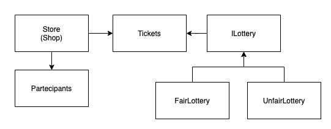

# my-lottery

A node-Typescript application.

## Application Architecture



## How to Run 

### Requirements
- yarn: https://classic.yarnpkg.com/en/docs/install/

```bash
git clone https://github.com/ironoa/my-lottery.git
cd polkadot-watcher-csv-exporter
cp config/main.sample.yaml config/main.yaml 
#just the fist time

yarn
yarn start
#or
#yarn start -c ./config/main.yaml 
#or
#yarn simulate
```

## How to Test 

### Requirements
- yarn: https://classic.yarnpkg.com/en/docs/install/

```bash
git clone https://github.com/ironoa/my-lottery.git
cd my-lottery
#just the fist time

yarn
yarn test
```

## How to Docker

```bash
docker build . -t my-lottery

#run
docker run my-lottery
cp config/main.sample.yaml config/main.yaml #if not present

#test
docker run --entrypoint /bin/sh my-lottery -c 'yarn test'
```